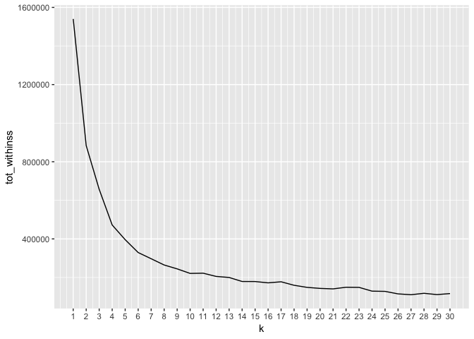
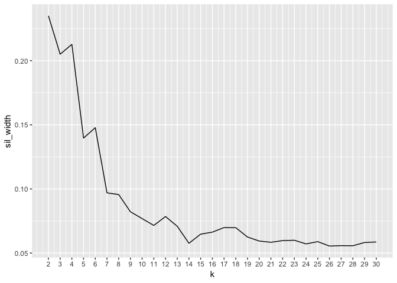
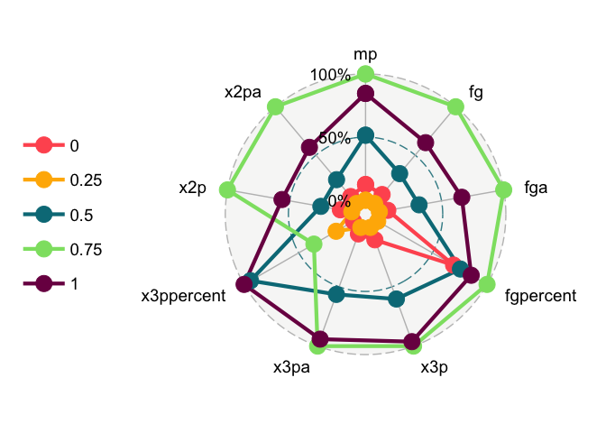

NBA Clustering Report
================

The clustering analysis uses the ballr package to access the per game statistics of players in the 2019 season from <https://www.basketball-reference.com/>

``` r
#The clustering analysis uses the ballr package to access the per game statistics of players in the 2019 season 
#from https://www.basketball-reference.com/ 
library(ballr)
NBA <- NBAPerGameStatistics(season = 2019)
NBA <- NBA[, 8:28]
```

Data preperation for this clustering analysis includes getting rid of all null values by imputing 0, scaling the data, and calculating distance measures.

``` r
#Data preperation for this clustering analysis include filtering out players who played less
#than 41 games, getting rid of all null values by imputing 0, scaling the data, calculating the 
#distance measures.
library(tidyverse)
NBA_dist <- NBA %>%
  replace_na(.) %>%
  scale(.) %>%
  dist(.)
```

The following runs kmeans with a k between 1 and 30. It then saves the sum of squares for each model. The goal of this is to determine the optimal number of clusters that we will use to describe the data.

``` r
#The following runs kmeans with a k between 1 and 30. It then saves the sum of squares for 
#each model
tot_withinss <- map_dbl(1:30,  function(k){
  model <- kmeans(NBA_dist, centers = k)
  model$tot.withinss
})
```

Creates a dataframe for the sum of squares for each kmeans model.

``` r
#Creates a dataframe for the sum of squares for each kmeans model
elbow.NBA <- data.frame(
  k = 1:30,
  tot_withinss = tot_withinss
)
```

Plots the sum of squares for each level of k so that the optimal k can be chosen. Here, the elbow seems to be anywhere from k = 5 to k = 7. Since there are five positions in the NBA, a good place to start would be at k = 5.

``` r
# Plots the sum of squares for each level of k so that the optimal k can be chosen (k = 5)
ggplot(elbow.NBA, aes(x = k, y = tot_withinss)) +
  geom_line() +
  scale_x_continuous(breaks = 1:30)
```



Runs a Kmeans model and keeps the silhouette widths for each level of k. Silhouette width measures how well clustered the objects are. Values range from -1 to 1 with higher values indicating a better fit.

``` r
#Runs a Kmeans model and keeps the silhouette widths for each level of k
library(cluster)
sil_width <- map_dbl(2:30,  function(k){
  model <- pam(NBA_dist, k = k)
  model$silinfo$avg.width
})
```

Creates a dataframe that contains the silhouette width for each level of k.

``` r
# Creates a dataframe that contains the silhouette width for each level of k
sil_NBA <- data.frame(
  k = 2:30,
  sil_width = sil_width
)
```

Plots the silhouette widths for each level of k to see how well on average each player fits in their cluster.

``` r
# Plots the silhouette widths for each level of k to see how well on average each player
#fits in their cluster
ggplot(sil_NBA, aes(x = k, y = sil_width)) +
  geom_line() +
  scale_x_continuous(breaks = 2:30)
```



Creates a Kmeans model with k = 5 and creates a dataframe with cluster assignments.

``` r
#Creates a Kmeans model with k = 5
NBA.Kmeans5 <- kmeans(NBA_dist, centers = 5, nstart = 25)

#Takes the cluster assignments from the model
cluster.NBA <- NBA.Kmeans5$cluster
```

``` r
#Creates two seperate data frames one for assigning the cluster assignments to players and
#another data frame to analyze the means of each cluster
Cluster.Assignments <- mutate(NBA, cluster = cluster.NBA)
```

``` r
#Calculates the mean for each stat by cluster
Cluster.means <- aggregate(Cluster.Assignments, by = list(Cluster.Assignments$cluster), FUN = "mean", na.rm = TRUE)
```

It seems that the clusters are measuring tiers of performance with Cluster 4 ranking highly for most categories.

``` r
#https://www.ggplot2-exts.org/ggradar.html
library(ggradar)
library(ggplot2)
library(scales)

Cluster.means %>%
  as_data_frame() %>%
  mutate_if(is_numeric, funs(rescale)) %>%
  select(1:10) -> Cluster.means.radar

ggradar(Cluster.means.radar)
```


